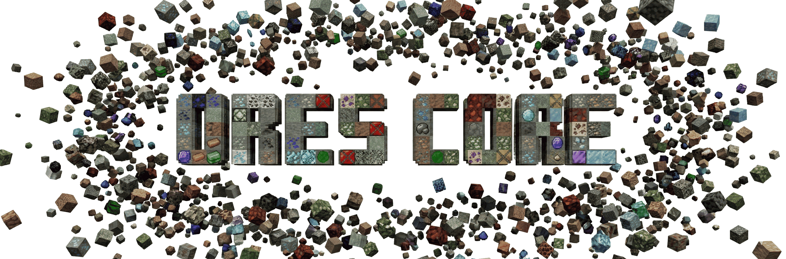
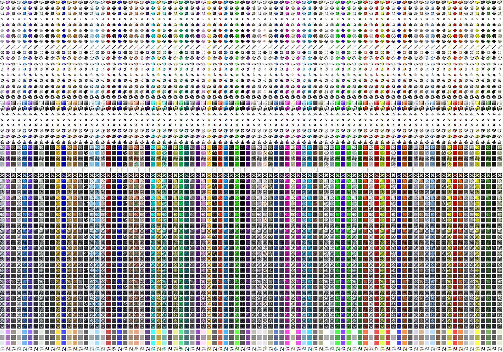

<div align="center">
  
  <p><strong>The ultimate material unification and dynamic resource library for Minecraft.</strong></p>

  [](https://fabricmc.net/)
  [](https://neoforged.net/)
  [](LICENSE)
</div>

---

## 💎 What is Ores Core?

**Ores Core** is a high-performance library designed to solve two of the biggest hurdles in modded Minecraft: **material fragmentation** and **repetitive resource creation**. Built for modern Minecraft (**26.1+** and beyond), it serves as a unified foundation for both players and developers.

### 🚀 Key Solutions
*   **🚫 No More Duplicate Materials:** Tired of having five different types of "Tin Ingot" in your modpack? Ores Core unifies common materials under a single set of tags and items.
*   **🎨 Dynamic Asset Generation:** Why manually create textures, models, and loot tables for 90+ materials? Ores Core automatically generates textures and models on the fly. **Crucially, only the textures actually used by your modpack are generated in memory**, meaning the mod remains incredibly lightweight and loads instantly, even with thousands of potential combinations. While most are procedural, the mod also incorporates **bespoke, hand-crafted designs**.
    *   *I believe the best materials are shaped together!* If you have **custom texture ideas** or proposals to improve how Minecraft materials look: 👉 **[Suggest your designs here](https://github.com/MathieuDorval/ORES-CORE/issues/new?template=proposition_contenu.yml)**
*   **♾️ Infinite Ore Types:** Ores are generated dynamically, allowing for an **infinity of ore types** from any mod. Whether it's a common material or a unique modded resource, Ores Core makes **all mods compatible** out of the box—no more ugly stone ores in the middle of your beautiful modded stones!
*   **⚡ Zero Dependencies & Blazing Fast:** Ores Core has **no dependencies**. Because it only generates the absolute minimum required assets at runtime, it ensures maximum performance and ultra-fast updates to the latest Minecraft, Fabric, or NeoForge versions.
*   **🏔️ Advanced World Generation:** A bespoke, centralized system that goes far beyond vanilla limitations. It features custom ore shapes and advanced vertical distributions for a unique underground experience.
    *   *Take full control:* Use **[Config Generator](https://mathieudorval.github.io/ORES-CORE/tools/ore_gen_manager.html)**.

---

## 🛠️ For Developers: Getting Started

Stop wasting time manually registering items, blocks, and ores for standard materials. Not only is it repetitive, but it also creates the "Material Fragment" nightmare for modpack creators—leaving them to deal with multiple types of the same ingot that don't always interoperate.

By using **Ores Core**, you can focus purely on your mod's unique logic. Simply use **Common Tags** in your recipes and loot tables, and let Ores Core handle the rest: **automatic models, textures, and advanced world generation.**

### 1. Add Dependency
Add Ores Core to your `build.gradle`:

```gradle
repositories {
    maven { url "https://jitpack.io" }
}

dependencies {
    // For developers working in a 'Common' module:
    compileOnly "com.github.MathieuDorval:ORES-CORE:common:v${mod_version}"

    // Implementation for specific loaders:
    // Fabric
    modImplementation "com.github.MathieuDorval:ORES-CORE:fabric:v${mod_version}"
    // NeoForge
    implementation "com.github.MathieuDorval:ORES-CORE:neoforge:v${mod_version}"
}
```

### 2. Define Your Materials
Simply place a `registry.json` in your resources: `src/main/resources/data/ores/registry.json`.

You only need to list the IDs of the materials and items that your mod actually requires—nothing more. Ores Core will automatically pick up your configuration and handle the rest.

> 💡 **Tip:** Use the **[Interactive Registry Generator](https://mathieudorval.github.io/ORES-CORE/tools/registry_generator.html)** to generate this file without writing a single line of JSON!

```json
{
  "materials_registry": ["tin_ingot", "tin_nugget", "raw_tin", "tin_block"],
  "ore_generation": ["tin"],
  "stones_replacement": ["your_mod:custom_stone", "your_mod:custom_rock"]
}
```

### ⛰️ Support for Custom Stone & Terrain Mods
Does your mod add new types of natural blocks (like custom stones or rocks) but no new ores? You can still integrate perfectly!

By registering your custom blocks in the `stones_replacement` array, you allow Ores Core to automatically generate ore variations inside your terrain across all dimensions and biomes. **The generated ore seamlessly inherits all properties of your custom host block**—if your custom stone falls like sand or features an animated texture, the dynamically generated ore will perfectly copy those behaviors and visuals! This ensures that all ores from any mod using Ores Core will appear naturally within your custom world generation.

> 💡 **Tip:** Use the **[Interactive Registry Generator](https://mathieudorval.github.io/ORES-CORE/tools/registry_generator.html)** to easily generate the configuration for your host blocks!

---

## 🌐 Global Support & Languages

Ores Core is built for a global audience, ensuring that every generated item, block, and material is properly named in your language. 

**Currently supported:** 🇺🇸 EN, 🇫🇷 FR, 🇪🇸 ES, 🇮🇹 IT, 🇩🇪 DE, 🇧🇷 PT, 🇷🇺 RU, 🇨🇳 ZH, 🇯🇵 JP.

---

## ⛏️ Advanced Ore Generation

Stop relying on messy "Swiss cheese" underground generation. Ores Core uses a sophisticated system in `config/ores/ores-generation.toml`:

| Feature | Description |
| :--- | :--- |
| **Vein Types** | `CLASSIC` (procedural blobs) or `GIANT` (massive deposits replaced in host blocks, similar to vanilla's **Tuff-Iron** veins). |
| **Custom Shapes** | Move beyond spheres with `BLOB`, `PLATE` (flat), `HORIZONTAL` (tubes), `VERTICAL` (columns), or `SCATTERED`. |
| **Distributions** | Advanced vertical control: `UNIFORM`, `TRAPEZOID`, `GAUSSIAN`, `TRIANGLE_HIGH`, or `TRIANGLE_LOW`. |
| **Multi-Material** | Mix multiple ores in a single vein with customizable **ratio weights**. |
| **Filtering** | Precision control with **Whitelist/Blacklist** for both **Dimensions** and **Biomes**. |
| **Specifics** | Fine-tune placement rules like `AIR_ONLY`, `CAVE_ONLY`, `WATER_ONLY`, `LAVA_ONLY`, or `UNIQUE`. |
| **Air Exposure** | Toggle `airExposureChance` to control if ores should be visible on cave walls. |

> 💡 **Tip:** Do you have ideas for new shapes, distributions, or custom specifics to add to Ores Core? **[Suggest them here!](https://github.com/MathieuDorval/ORES-CORE/issues/new?template=feature_request.md)**

---

## 🏷️ Common Tags

Every item and block (from simple ingots to complex Mekanism slurries) is automatically registered into **Common Tags** (`#c`). This ensures that your recipes and machines are universally compatible.

> 📚 **Check the [Full Supported Content List](https://mathieudorval.github.io/ORES-CORE/tools/material_reference.html)** for a complete reference of the 90+ materials and their specific tag paths.

---

## 🧩 Compatibility

Ores Core acts as a universal bridge. Native support is built-in for major tech mods, ensuring all materials can be processed through their machines without extra setup:

*   **⚙️ Mekanism:** Full processing chain support (Slurries, Crystals, Shards, Clumps, Dirty Dusts, Dusts) via **Chemical Dissolution**, **Washer**, **Crystallizer**, and **Combiner**.
*   **🚂 Create:** Automated recipes for **Crushing Wheels**, **Milling**, and **Pressing** are included out of the box.

---

## 📚 Supported Content

Ores Core manages over **90+ materials** and **20+ item/block types**, offering **infinite compatibility** for all ore types and variations.

### 🍱 Automated Recipes & Processing
Don't worry about standard recipes; Ores Core generates them all automatically to ensure a consistent experience:
*   **🔄 Complete Cycles:** Compression and decompression between **Nuggets ↔ Base Items ↔ Blocks**.
*   **🔥 Smelting & Blasting:** Full support for smelting **Raw Metals** and **Dusts** into their respective ingots. You can also smelt **Raw Blocks** and **Dust Blocks** directly into standard storage blocks.
*   **⚙️ Mod Processing:** Native integration for **Mekanism** processing chains (Crushing, Enriched, Grinding, etc.).
*   **🏗️ Extreme Storage:** Blocks, Raw Blocks, and even Dust Blocks support **Compressed Variations up to Tier 9 (x9)** for ultimate storage density.

### ⚙️ Bespoke Material Properties
Every material, item, and block is more than just a name. They all feature **tailored properties** fine-tuned for a balanced experience. Here is a non-exhaustive list of what can be customized for each material:

*   **💎 General:** Rarity, Fireproof, Fuel Time, Beacon Payment, Piglin Loved, Trimmable.
*   **🏗️ Block Physics:** Hardness & Resistance Factors, Slipperiness, Speed & Jump Factors, Gravity Mode, Push Reaction.
*   **🎨 Visuals & Audio:** RGB Color Tinting (Base & Raw), Particle Emitters, Map Colors, Sound Types, Light Levels.
*   **🔌 Technical:** Redstone Power, Note Block Instruments.
*   **⛏️ Worldgen & Mining:** Mining Levels, Custom Drops (Quantity & XP), Smelting XP/Time.
*   **🧪 Chemical:** Custom Slurry colors for Mekanism integration.

> 📖 **[View the Full Material Property Reference](https://mathieudorval.github.io/ORES-CORE/tools/material_reference.html)** for a detailed list of every material and its default statistics.

*I want these properties to be perfect for the entire modding community!* If you feel that a material's stats should be adjusted or improved:
👉 **[Propose property changes here](https://github.com/MathieuDorval/ORES-CORE/issues/new?template=proposition_contenu.yml)**

---

---
---
## 📊 Content Overview
A comprehensive table showcasing all items, blocks, and materials generated by **Ores Core**:




## 🔗 Quick Links

| Resource | Description | Link |
| :--- | :--- | :--- |
| **Registry Generator** | Visual tool to create your `registry.json` | [Open Tool](https://mathieudorval.github.io/ORES-CORE/tools/registry_generator.html) |
| **Ore Gen Manager** | Configure density and distribution in `ores-generation.toml` | [Open Tool](https://mathieudorval.github.io/ORES-CORE/tools/ore_gen_manager.html) |
| **Material Reference** | Explore all 90+ materials and their properties | [Open Tool](https://mathieudorval.github.io/ORES-CORE/tools/material_reference.html) |
| **Content Proposals** | Suggest new materials, items, blocks, or textures | [Submit Proposal](https://github.com/MathieuDorval/ORES-CORE/issues/new?template=proposition_contenu.yml) |
| **Feature Requests** | Suggest new shapes or worldgen distributions | [Request Feature](https://github.com/MathieuDorval/ORES-CORE/issues/new?template=feature_request.md) |
| **Bug Tracker** | Report a bug or a technical issue | [Report Bug](https://github.com/MathieuDorval/ORES-CORE/issues/new?template=bug_report.md) |

---

## 🚀 Next Steps & Roadmap

The journey doesn't stop here! Here is what is coming next for **Ores Core**:

*   **🌊 Fluid & Molten Support:** Full automatic generation of liquid variants (like molten metals) along with their respective buckets, physics, flowing textures, and interactions.

Furthermore, I am currently developing **Ores Mod**, the ultimate companion for modpack creators designed to work seamlessly with Ores Core.

**What to expect from Ores Mod:**
*   **⚙️ Total Control:** Every property of materials, items, blocks, and worldgen will be fully customizable through a single config file to perfectly match your modpack's universe.
*   **📦 Standalone Support:** Add your own custom items and materials directly through the mod, even if no other mod uses them.
*   **🔄 Aggressive Unification:** Automatically handle mods that don't yet use Ores Core by replacing duplicate items, recipes, loot tables, and tags—ensuring **true material unification** across your entire pack.

---

## 📄 License & Credits

- **License:** [CC BY-NC-SA 4.0](LICENSE) (Attribution-NonCommercial-ShareAlike).
- **Author:** Developed with ❤️ by **__mathieu**.

---
<div align="center">
  <sub>Shaping Minecraft materials together through community-driven design.</sub>
</div>
