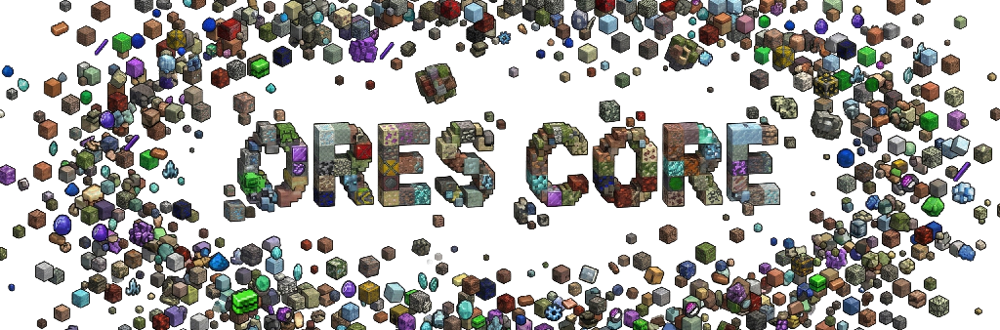

  
  
<strong>The ultimate material unification and dynamic resource library for Minecraft.</strong>

  
  
  
  
  

---

## 💎 What is Ores Core?

**Ores Core** is a high-performance library and asset generation engine designed to solve two of the biggest hurdles in modern Minecraft (**26.1+**) modding: **material fragmentation** and **repetitive resource creation**. It serves as an open, community-driven foundation for both players and developers.

### 🛠️ Why use Ores Core?
Stop wasting days of development time creating identical basic resources over and over again! With Ores Core, you simply declare the materials your mod needs through a JSON file, and the core instantly generates the items, blocks, recipes, dynamically constructed textures, and seamlessly integrates them into the world generation for you.

Currently, **Ores Core manages over 90+ base materials, pushing 5000+ potential item/block combinations**, and guarantees an absolute **infinity of custom ore variations** by injecting those materials natively into any stone block from any mod!

**Missing a specific material or variation for your mod?**  
Ores Core is built to be a universal tool crafted *for* the community. If you don't find the resource you need, just [submit a content proposal](https://github.com/MathieuDorval/ORES-CORE/issues/new?template=proposition_contenu.yml). It takes merely a single line of code on our end to add full generation capabilities for a new material, instantly making it available and globally unified for everyone else!

## 📖 Documentation & Wiki

We have recently migrated all our detailed documentation to a comprehensive Wiki! Whether you are a mod developer looking to offload asset generation, or a modpack creator trying to unify a massive mod list, check out the resources below:

- 📚 **[General Functioning](docs/Home.md)**: Explore how Ores Core manages models, textures, and items dynamically.
- 🎮 **[For Players](docs/For-Players.md)**: Simple installation guide and what Ores Core does for your game.
- 💻 **[For Mod Creators](docs/For-Mod-Creators.md)**: Learn how to let Ores Core handle your mod's standard materials, saving you hours of boilerplate code.
- 🛠️ **[For Modpack Creators](docs/For-Modpack-Creators.md)**: Master global material economies, massive unifying systems, and unparalleled custom world generation.
- 🎨 **[Textures and Models](docs/Textures-and-Models.md)**: Details on the dynamic asset engine and visual inspirations.
- ⚙️ **[API Reference](docs/API-Reference.md)**: Documentation for our Java API.

---

## ✨ Introducing Ores Mods

If you are building a modpack, you need **Ores Mods**.

**Ores Mods** is the ultimate companion to **Ores Core**, specifically designed to solve the common issue of cluttered and duplicated resources in significantly heavily modded environments.

### Two Core Aspects of Ores Mods:
1. **Total Material Unification**: Say goodbye to having 5 different types of Copper or Lead in your inventory. Ores Mods automatically unifies identical resources (ores, ingots, nuggets, raw materials, plates, gears, etc.) from different mods into a single type, hiding duplicates from JEI/EMI, and keeping crafting seamless.
2. **Infinite Ore Generation**: Generate an infinite variety of ores combining any material type with *any* stone or block type from *any* installed mod. You are no longer limited by what mods provide out of the box.

*Ores Mods gives unprecedented power to Modpack Curators. See our **[Modpack Creators Wiki](docs/For-Modpack-Creators.md)** to learn more.*

**Download Ores Mods:** [Modrinth](https://modrinth.com/project/ores-mods) | [CurseForge](https://www.curseforge.com/minecraft/mc-mods/ores-mods)

---

## 🐛 Issues & Bug Tracking

If you encounter technical issues or visual bugs regarding **Ores Core** or **Ores Mods**, please report them via our issue tracker.

👉 **[Report a Bug (Ores Core)](https://github.com/MathieuDorval/ORES-CORE/issues/new?template=bug_report_ores_core.md)**  
👉 **[Report a Bug (Ores Mods)](https://github.com/MathieuDorval/ORES-CORE/issues/new?template=bug_report_ores_mods.md)**  
👉 **[Propose a Texture or Content](https://github.com/MathieuDorval/ORES-CORE/issues/new?template=proposition_contenu.yml)**  
👉 **[Request a Feature](https://github.com/MathieuDorval/ORES-CORE/issues/new?template=feature_request.md)**

---

## 🔗 Quick Tools

| Resource | Description | Link |
| :--- | :--- | :--- |
| **Registry Generator** | Visual tool to create your `registry.json` | [Open Tool](https://mathieudorval.github.io/ORES-CORE/tools/registry_generator.html) |
| **Ore Gen Manager** | Configure density and distribution in `ores-generation.toml` | [Open Tool](https://mathieudorval.github.io/ORES-CORE/tools/ore_gen_manager.html) |
| **Material Reference** | Explore all 90+ materials and their properties | [Open Tool](https://mathieudorval.github.io/ORES-CORE/tools/material_reference.html) |

  

## 📄 License & Credits
- **License:** [CC BY-NC-SA 4.0](LICENSE)
- **Author:** Developed with ❤️ by **__mathieu**.
